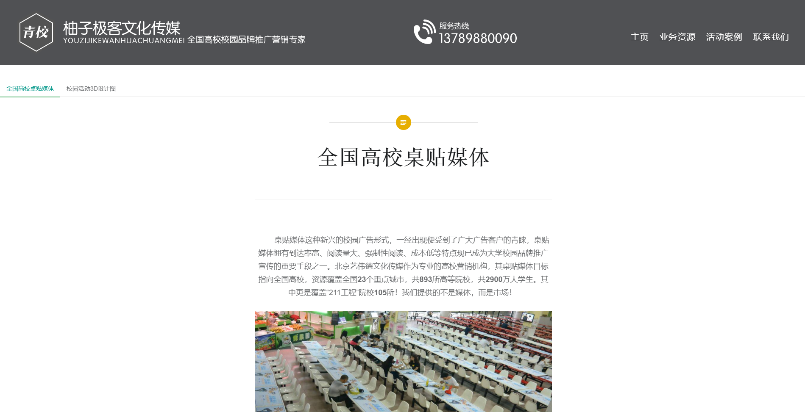

# 柚子极客文化传媒网站
[网站链接](http://www.qxiao.cn:8080/)

---

## 项目简介
* 青岛柚子极客文化传媒是一家专业提供游戏类校园推广、校园媒体投放、品牌校园公关活动的策划执行服务公司。
* 网站主要是对公司进行介绍推广，包括公司业务资源、活动案例的展示。后台管理则是对对应的业务资源、案例等的增删改查。

##项目构成

* 框架： SpringBoot+MyBatis
* 数据库 ：MySQL、Redis
* Thymeleaf 作模板引擎   
* layui作前端 UI 框架
* Maven构建
## 主要功能
* 业务资源展示

* 修改密码、记住密码
* 菜单管理
* 系统参数
* 权限节点
* 岗位管理
* 部门管理
* 用户组管理
* 用户管理

## 依赖
### java后端依赖环境
* Maven 3
* Java 8
* MySQL + Redis

## 工程说明
* cloud-config-server：配置中心。
* cloud-eureka-server：注册中心。
* cloud-simple-service：自定义的微服务。
* cloud-zipkin-ui：分布式链路调用监控系统，聚合各业务系统调用延迟数据，达到链路调用监控跟踪。
* cloud-vue : vue（Vue2.x + Vue-router2.x + Vuex)的前端项目

## 效果图

