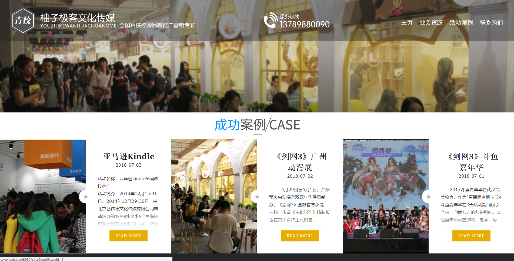
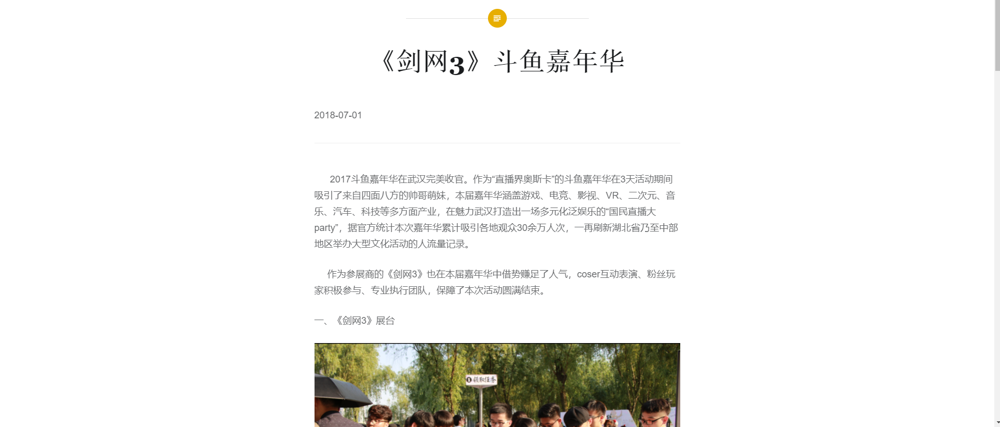
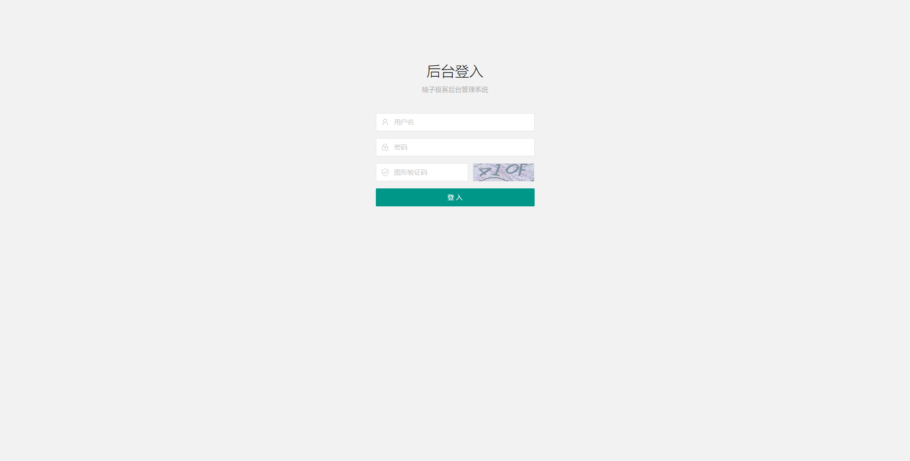
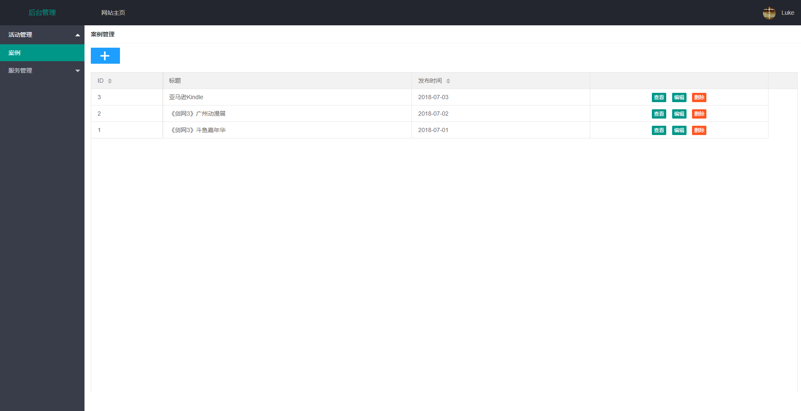
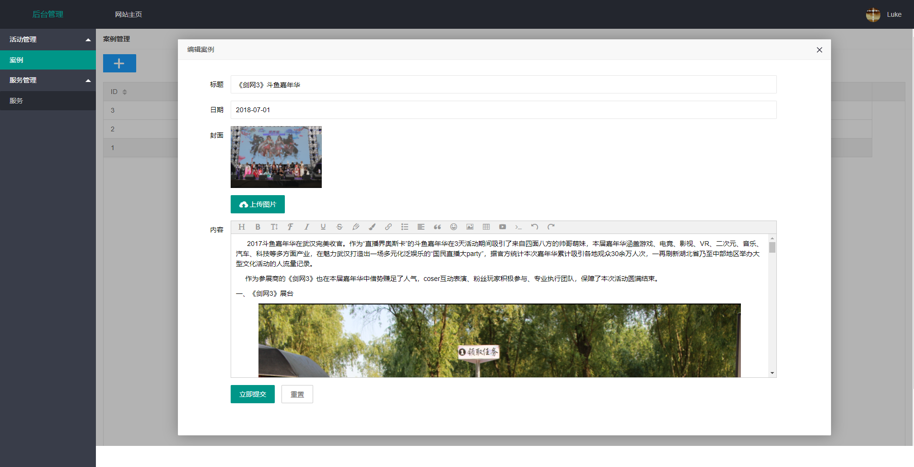
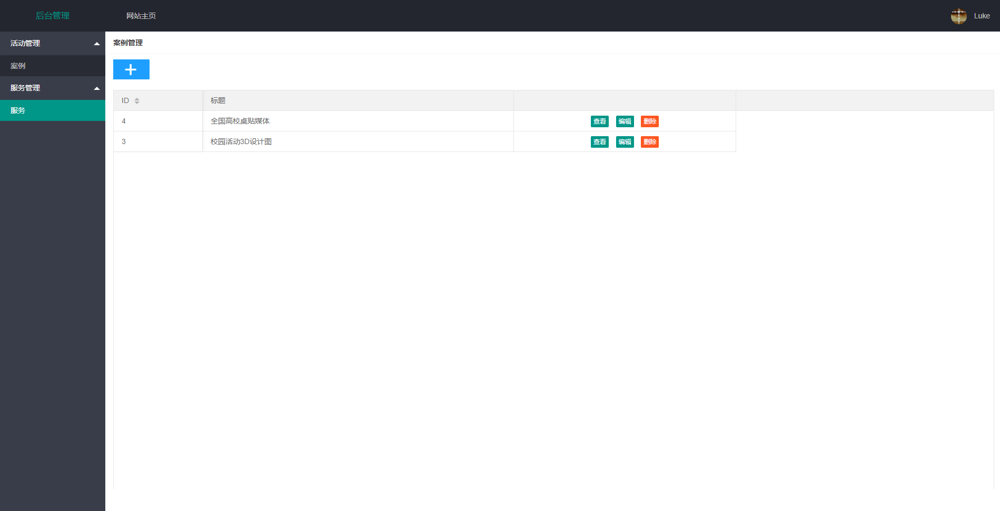
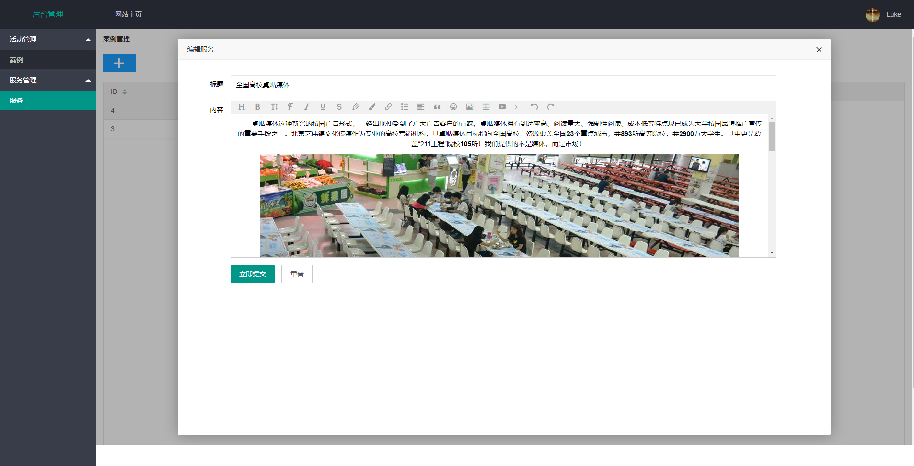

# 柚子极客文化传媒网站
[网站链接](http://www.qxiao.cn:8080/)

---

## 项目简介
* 青岛柚子极客文化传媒是一家专业提供游戏类校园推广、校园媒体投放、品牌校园公关活动的策划执行服务公司。
* 网站主要是对公司进行介绍推广，包括公司业务资源、活动案例的展示。后台管理则是对对应的业务资源、案例等的增删改查。

## 项目构成

* 框架： SpringBoot+MyBatis
* 数据库 ：MySQL、Redis
* Thymeleaf 作模板引擎   
* layui作前端 UI 框架
* Maven构建
* 图片上传：阿里云OSS服务
* 富文本编辑器：wangEditor3
## 主要功能
* 业务资源展示
 
* 活动案例展示
 
 
* 后台登入
 
* 案例管理
 
  
* 服务管理
 
  

